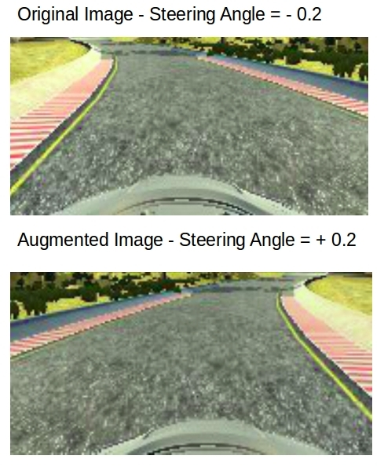

## Introduction ##

For this project there are several Python scripts: 
 - **config.py**: includes basic configuration parameters
 - **process_data.py**: script to generate features and labels sets
 - **labels_distributions.py**: utility to visualize how labels are distributed along the dataset
 - **model.py**: CNN Keras model 
 - **drives.py**: modified version of the original file to perform image transformations

I used the data generated after few laps on the basic circuit using "Dominic" version to benefit of a smoother steering wheel thus loosing left/right cameras.

## Pre-Processing ##

For my image pre-processing, I used some of the functions I developed for the [Traffic Sign Classifier Project](https://github.com/kingkastle/Self-Driving-Car-ND/blob/master/Traffic_Sign_Classifier.ipynb) as well as some techniques I learned on the separate blogposts by [Vivek Yadav](https://chatbotslife.com/using-augmentation-to-mimic-human-driving-496b569760a9#.5zfkeeph4), [Mojtaba Valipour](https://medium.com/@ValipourMojtaba/my-approach-for-project-3-2545578a9319#.em46k7679) and [Paul Heraty's](https://carnd-forums.udacity.com/questions/26214464/behavioral-cloning-cheatsheet). These post were helpful to better understand the project pipeline.

In order to digest the images, only the center camera is used, these are cropped and resized to reduce noise like horizonts and reduce computational costs, apart of this:
1. The image is randomly translated vertically
2. The image is randomly translated horizontally
3. The image brightness is randomly skewed (in HSV colorspace)
4. The image is randomly flipped horizontally (50% probability).
In the case of horizontal translation, a gain is applied to the magnitude of the translation, and this added to the input steering angle.  As the image is translated further and further, the steering angle adjustment is greater.  In the case of horizontal flipping, the steering angle is also flipped (multiple by -1).

A sample of my augmentation for a single image is shown here:




## CNN Model Architecture ##

My model architecture is based on that of Nvidia in their [end-to-end](http://images.nvidia.com/content/tegra/automotive/images/2016/solutions/pdf/end-to-end-dl-using-px.pdf) paper.  The differences are as follows: I did the normalization outside of the CNN with an explicit function, and rather than using multi-pixel strides during convolution, I used max pooling layers after the convolution.  It’s not clear if the authors used dropout, but as many references (blogposts above, Confluence posts, etc) cautioned about overfitting in this project, I included dropout after every layer. 

For the last layer I chose ‘tanh’ for my activation layer, to ensure I could get results between -1 and +1.  For all other layers I chose ‘relu’.

|Layer (type)                     |Output Shape          |Param #     |Connected to               |
|:--------------------------------|:---------------------|:-----------|:--------------------------|
|convolution2d_1 (Convolution2D)  |(None, 49, 99, 24)    |1176        |convolution2d_input_1[0][0]|
|_________________________________|______________________|____________|___________________________|
|convolution2d_2 (Convolution2D)  |(None, 23, 48, 36)    |13860       |convolution2d_1[0][0]      |
|_________________________________|______________________|____________|___________________________|
|convolution2d_3 (Convolution2D)  |(None, 10, 23, 48)    |27696       |convolution2d_2[0][0]      |
|_________________________________|______________________|____________|___________________________|
|convolution2d_4 (Convolution2D)  |(None, 8, 21, 64)     |27712       |convolution2d_3[0][0]      |
|_________________________________|______________________|____________|___________________________|
|flatten_1 (Flatten)              |(None, 10752)         |0           |convolution2d_4[0][0]      |
|_________________________________|______________________|____________|___________________________|
|dense_1 (Dense)                  |(None, 100)           |1075300     |flatten_1[0][0]            |
|_________________________________|______________________|____________|___________________________|
|dropout_1 (Dropout)              |(None, 100)           |0           |dense_1[0][0]              |
|_________________________________|______________________|____________|___________________________|
|dense_2 (Dense)                  |(None, 64)            |6464        |dropout_1[0][0]            |
|_________________________________|______________________|____________|___________________________|
|dense_3 (Dense)                  |(None, 10)            |650         |dense_2[0][0]              |
|_________________________________|______________________|____________|___________________________|
|dense_4 (Dense)                  |(None, 1)             |11          |dense_3[0][0]              |
|---------------------------------|----------------------|------------|---------------------------|
Total params: 1,152,869
Trainable params: 1,152,869
Non-trainable params: 0
____________________________________________________________________________________________________                

Graphical representation of the arcitecture.

## Training ##

I generated a dataset with shape: ```(11150, 100, 200, 3)```. For training, I divided the dataset into both training and validation sets, with an 80/20 split.  I didn’t explicitly make a test dataset, as the real test is whether the car is able to drive around the track in the simulator.  

My attempts at training the model, are unsuccessful, as the car seemed to drive almost perfectly straight all the time.  I suspect this is due the majority of the data having zero steering angle, and the model tending to overfit to this situation.  This is one difficulty of a mean-square error optimization when most of the output values are the same.  My first mitigation strategy for this was to remove images where the absolute value of the steering angle is less than 0.1. This approach eliminated 3431 images from the dataset but still didn't help to keep the car on track and not follow a straight line.


## Reflections ##

While it seems feasible to train a car to drive in this way (not achieved by me yet... :cry:), there are important limitations that need to be handled.  For instance, obstacle avoidance is not even discussed here.  Another example is understanding road conditions: wet, icy, sandy, etc.  Another important factor is driving during night conditions, this would be like training over a completely different dataset.

Another interesting behavior that I noted, in an early build of my model, was that the car would swerve around the shadow cast by a tree after the first turn.  Eventually this was removed through further training, but it is clear that the difference in brightness caused the car to thing that this was not an acceptable part of the road on which to drive.  This is an area that I hope we will explore further in the Advanced Lane Finding project.
